# Getting started with Tableau

## 1 About Tableau
[*Watch this on video.*](https://share.descript.com/view/VxZSpfvLRUD)

**Tableau is a powerful data visualization tool, in heavy use among both laypeople and data professionals.** Here are some examples of journalistic data visualization created with Tableau: 

- [CNBC’s coronavirus hot spots map](https://www.cnbc.com/2020/06/15/dr-scott-gottlieb-warns-us-coronavirus-hot-spots-could-quickly-get-out-of-control.html) 
- [*La Nacion*‘s investigation of corruption in Argentina](https://www.lanacion.com.ar/sociedad/la-ciudad-desembolsara-mas-8000-millones-jjoo-nid2178093) 
- [*Globe and Mail*‘s investigation of police brutality](https://public.tableau.com/profile/peter.kim#!/vizhome/FatalInteractionsInvolvingPolice2000-2017/Dashboard1)

[Tableau Public](https://public.tableau.com/en-us/s/) is the free version of this tool. There are several things to be aware of with regard to Tableau Public. 

- It’s free to download and use, but, aside from screenshots, the only way to share an interactive version is to create a Tableau Public account. 
- When you share a Tableau Public visualization, any viewer will be able to download the underlying data, unless you purchase a “premium” Tableau Public subscription (or ask me for a student license key).

However, you do not need to create an account in order to use Tableau Public on your own computer. We will use it today to make two charts, which we’ll combine into a dashboard. [Here is a preview of what we’ll make.](https://public.tableau.com/profile/miriam.posner#!/vizhome/IowaArtsGrants2015/Dashboard1?publish=yes) At the end of this tutorial, you’ll find information on how to publish your work to the web.

## 2 Download your dataset
Click [here](https://www.dropbox.com/s/jitkywq05cpeq2u/IAC.csv?dl=1) to download the CSV we’ll use. Don’t open it yet, but be sure to save the file somewhere you’ll be able to find again. It’ll look familiar; it’s the Iowa Arts Council data again.

## 3 Choose your data source
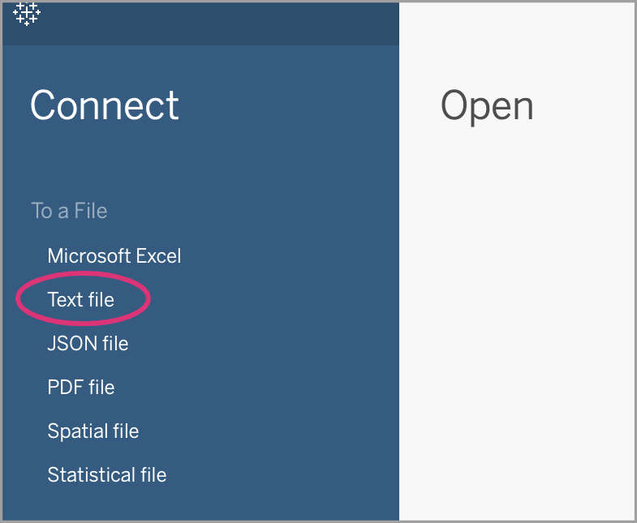
[*Watch this on video.*](https://share.descript.com/view/VxZSpfvLRUD?t=74.978)

After opening Tableau, you’re presented with a list of file types you can choose to work with (“connect”). Even though our Iowa Arts Council Grants file *opens* in Excel, it’s saved as a CSV. To Tableau, a CSV is a text file. So select **Text file**. Then navigate to the file you downloaded earlier and double-click to open it.

## 4 Create a sheet
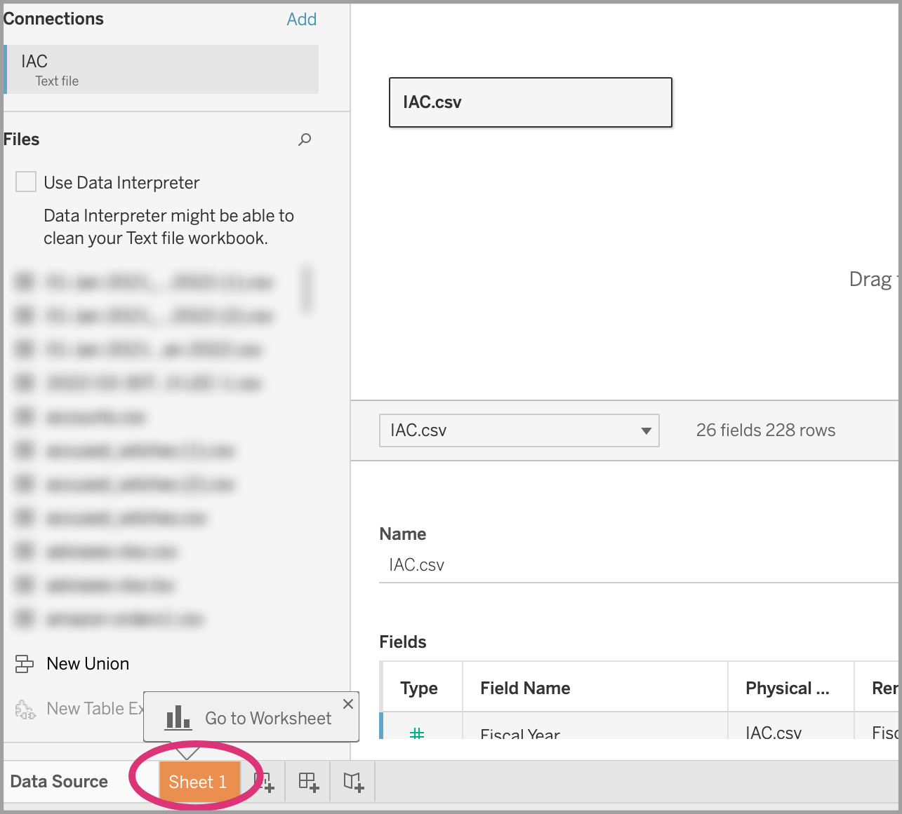
[*Watch this on video.*](https://share.descript.com/view/VxZSpfvLRUD?t=106.603)

When you import a CSV, Tableau gives you some information about the file. There’s a lot of information to take in, but you might notice that the sheet contains 26 fields and 228 rows. And in the bottom right corner, Tableau is showing you the table itself. The rest of the information might make more sense later.

For now, let’s start visualizing our data by creating a **Sheet**. Do that by clicking on the orange **Sheet** button in the lower left-hand corner.

## 5 Data types in Tableau
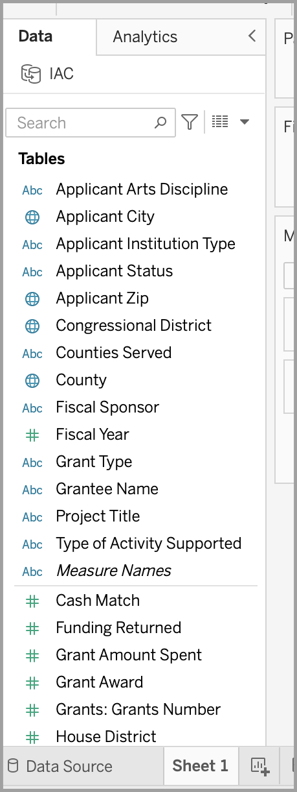
[*Watch this on video.*](https://share.descript.com/view/VxZSpfvLRUD?t=134.468)

Take a look at the fields Tableau has provided for you on the left side of the window. Tableau divides your content types (that is, your columns) into **dimensions** and **measures**. Measures generally consist of numeric information: values that can be added together. Dimensions are categorical: they’re ways to divide up your data. Tableau will often provide recommendations based on these data types.

One way to figure out if your data type is a dimension or a measure is to ask, does it make sense to add these up? For example, it makes sense to add up applicants’ funding levels (measure), but *not* their zip codes (dimension)! Zip codes are numbers, but they *aren’t* measures. 

If Tableau is right about the division of your content types, you don’t need to do anything! But occasionally you’ll want to correct Tableau’s categorizations.

If you'd like to learn more, h[ere’s a nice explanation of dimensions vs. measures.](https://learning.oreilly.com/library/view/practical-tableau/9781491977309/ch06.html#:-:text=Chapter%206.%20Dimension,data%20in%20Tableau)

## 6 Which fields are miscategorized?
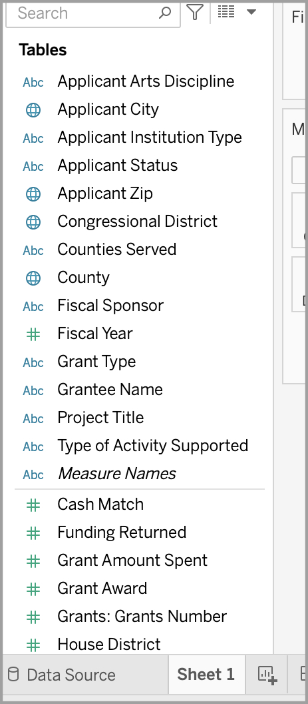
[*Watch this on video.*](https://share.descript.com/view/VxZSpfvLRUD?t=218.261)

Two of the measures in your list of fields should actually be dimensions. That means that Tableau thinks they're numerical measures, but they're actually categories.

Look closely at your list of measures. Can you figure out which one is miscategorized? Remember, one way to determine this is to ask, does it make sense to add up the contents of this data type?

(Advance to the next step to check your answer!)

## 7 Convert miscategorized fields
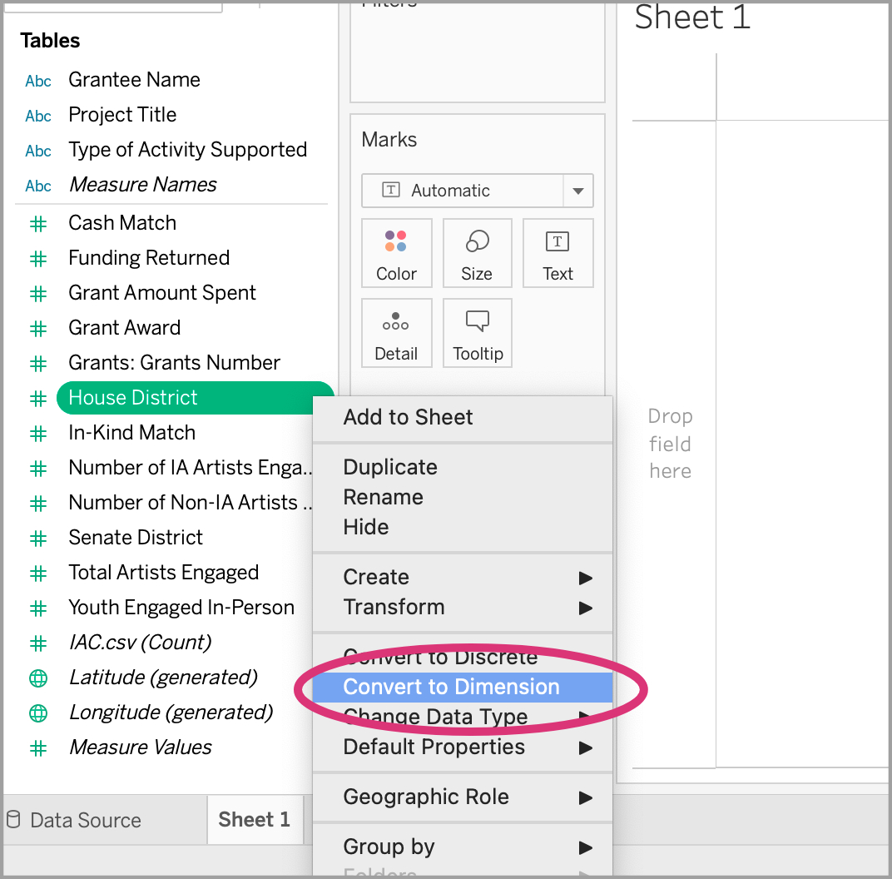
[*Watch this on video.*](https://share.descript.com/view/VxZSpfvLRUD?t=240.244)

Maybe you figured this out: Tableau has miscategorized **House District** and **Senate District** as measures, when they should be dimensions. It wouldn’t make sense to add up house district numbers, find their average, or perform other mathematical operations on them. They're categories—that is, dimensions!

To recategorize this data type, click on the field name to reveal the context menu. Then select **Convert to Dimension**. Do this for both House District and Senate District.

## 8 Your first visualization
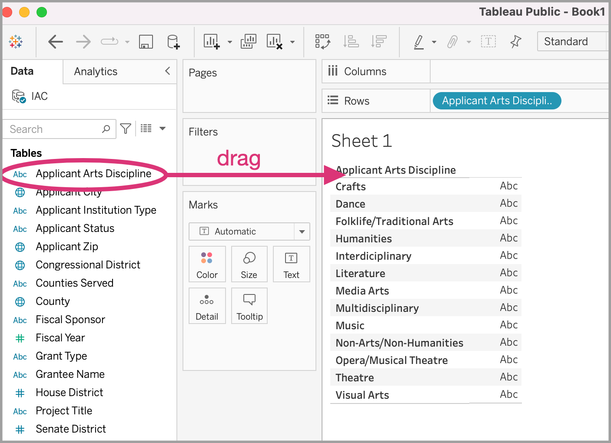
[*Watch this on video.*](https://share.descript.com/view/VxZSpfvLRUD?t=269.877)

Get started by clicking on **Applicant Arts Discipline** and drag it into the main section of the sheet (the **canvas**). It's not hugely exciting; you just see a list of arts disciplines.

There's a reason for that: Tableau doesn't know what you want it to count. You need a measure!

## 9 Tell Tableau which measure to use
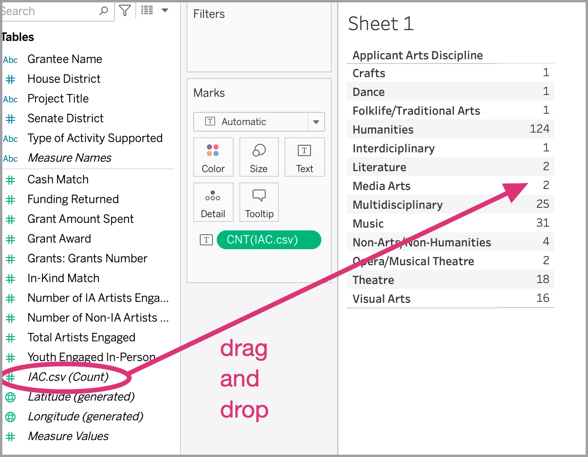
[*Watch this on video.*](https://share.descript.com/view/VxZSpfvLRUD?t=311.532)

We want Tableau to create a chart that visualizes the number of grants awarded per arts discipline. In order to do that, we need Tableau to count up the values for each category.

Scroll to the bottom of the **Data** column, and look at the measure types that are in italics. You'll see that they contain the word **generated** next to them in parentheses. This means that these are numbers that Tableau has calculated for you.

You'll notice a measure called **IAC.csv (Count)**. This measure provides a count of all grants. 

Click on this measure and drag it to the table on your canvas. Drop it in the second column of the table, where the values are currently represented as "Abc."

## 10 Choose the chart type you want
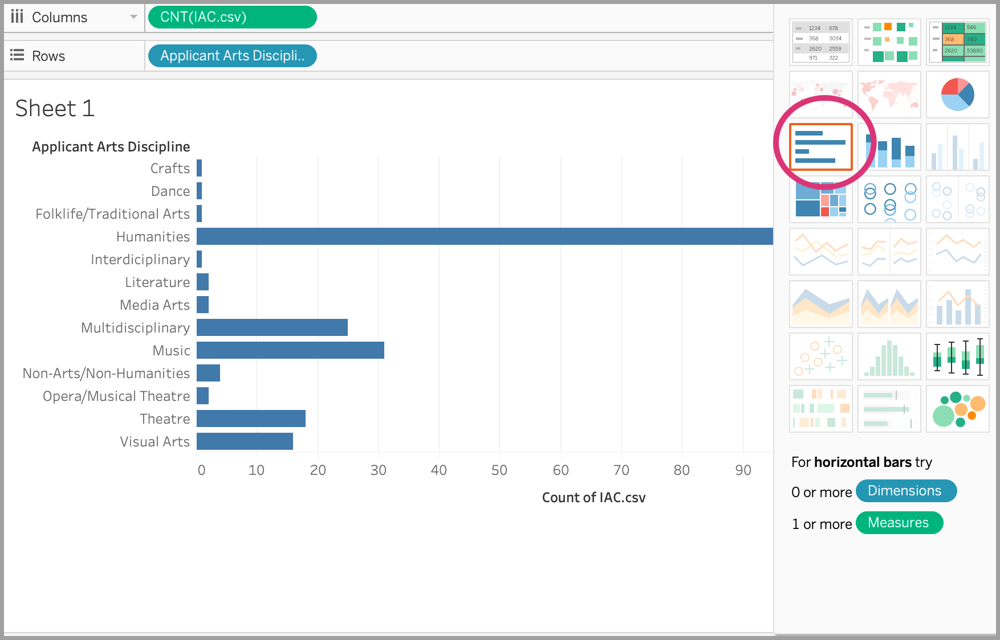
[*Watch this on video.*](https://share.descript.com/view/VxZSpfvLRUD?t=387.646)

Once you've dropped the "IAC.csv (Count)" measure, you'll see that the arts disciplines are nicely summarized for you in the table you created. You'll also notice that highlighted options appear in the palette of chart types on the right-hand side of your window. 

Now that you have measures, you have some chart options! Click on the **bar chart.**

## 11 Compare multiple values
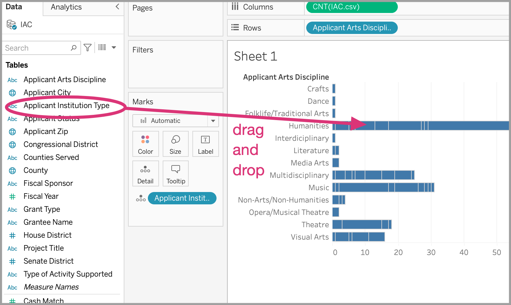
[*Watch this on video.*](https://share.descript.com/view/VxZSpfvLRUD?t=445.458)

You created a visualization! Now, let's see if we can create a stacked bar chart to show how Application Institution Type correlates with **Application Arts Discipline**.

Luckily, this is easy. Just drag the **Application Institution Type** measure onto the bar chart you've already created.

## 12 8. Create a stacked bar chart
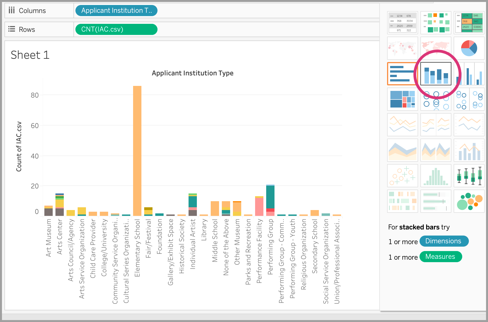
[*Watch this on video.*](https://share.descript.com/view/VxZSpfvLRUD?t=489.147)

Now, let's switch to a stacked bar chart, so we can see the distinctions among institution types more clearly. You'll notice that as you hover over each segment, a tooltip gives you more information.

## 13 Give your chart a name
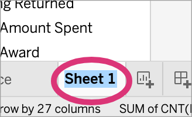
[*Watch this on video.*](https://share.descript.com/view/VxZSpfvLRUD?t=527.877)

Double-click on your chart's title on the tab below your canvas (it currently reads **Sheet 1**) to give it a more descriptive name.

## 14 Start a new chart
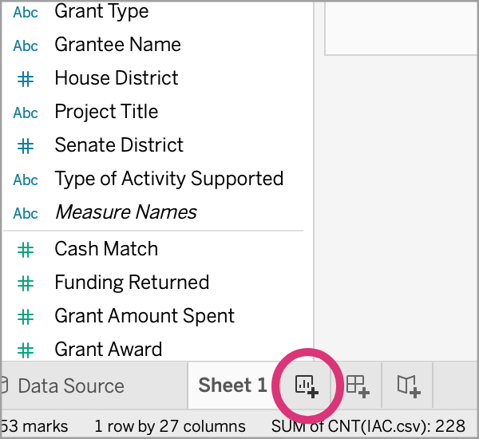
[*Watch this on video.*](https://share.descript.com/view/VxZSpfvLRUD?t=548.371)

Now let's make our second chart. Click on the **New worksheet** button at the bottom left of the Tableau window (circled in the image) to begin our new visualization.

## 15 Make a map
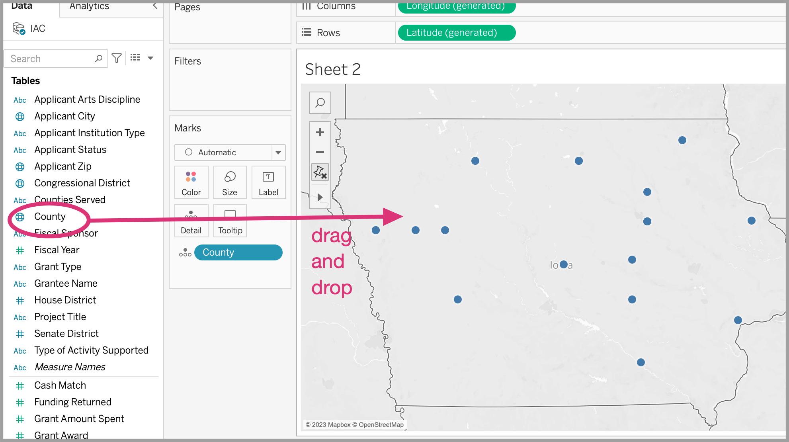
[*Watch this on video.*](https://share.descript.com/view/VxZSpfvLRUD?t=580.753)

Tableau has automatically geocoded our geographic dimensions. (That means it’s converted alphabetic addresses to computer-readable codes.) You can tell because a tiny globe appears next to them. Drag **County** into the main canvas area, and give Tableau a moment to work.

## 16 Add a measure
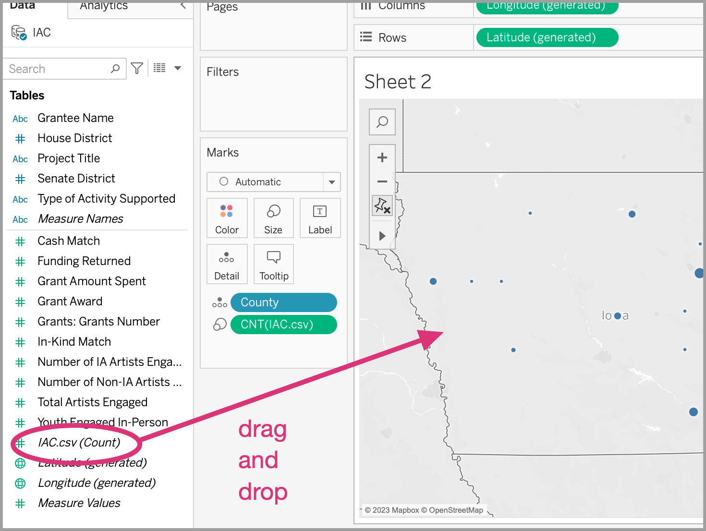
[*Watch this on video.*](https://share.descript.com/view/VxZSpfvLRUD?t=679.341)

Now that you've made a map, let's add a measure to it, so we can see how many grants went where. Drag ***IAC.csv (Count)*** into the main canvas area, on top of your map.

## 17 Fine-tune your map
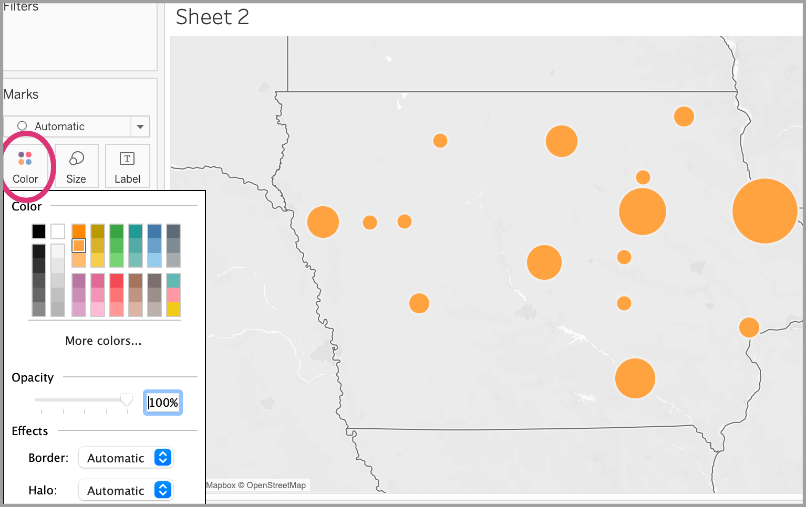
[*Watch this on video.*](https://share.descript.com/view/VxZSpfvLRUD?t=722.59)

Now the circles on your map grow larger as the number of grants awarded to that county increases. You can fine-tune the look of your map by altering the options in the **Marks window**. (Try the **Color** and **Size** buttons!) Give your new map a title, as you did for your chart.

## 18 Create a dashboard
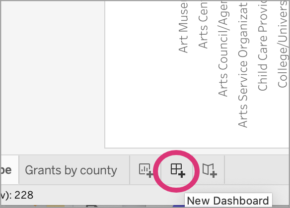
[*Watch this on video.*](https://share.descript.com/view/VxZSpfvLRUD?t=791.367)

Now we'll combine our charts to create a **dashboard** -- a snapshot of multiple visualizations. Do that by clicking on the **Dashboard** button at the bottom of your Tableau window, circled in the image.

## 19 Drag your sheets onto your dashboard
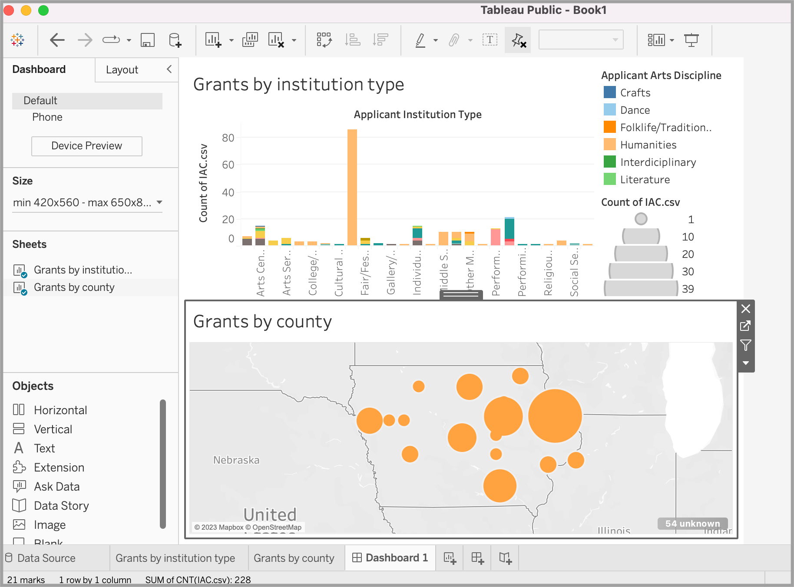
[*Watch this on video.*](https://share.descript.com/view/VxZSpfvLRUD?t=816.307)

One you've created a dashboard, locate the names of your two sheets on the left-hand side of the window, labeled **Sheets**. Click on each of your sheets in turn and drag them into your main canvas. (You can experiment with layout and other elements, too.) Very nice!

## 20 Export your dashboard
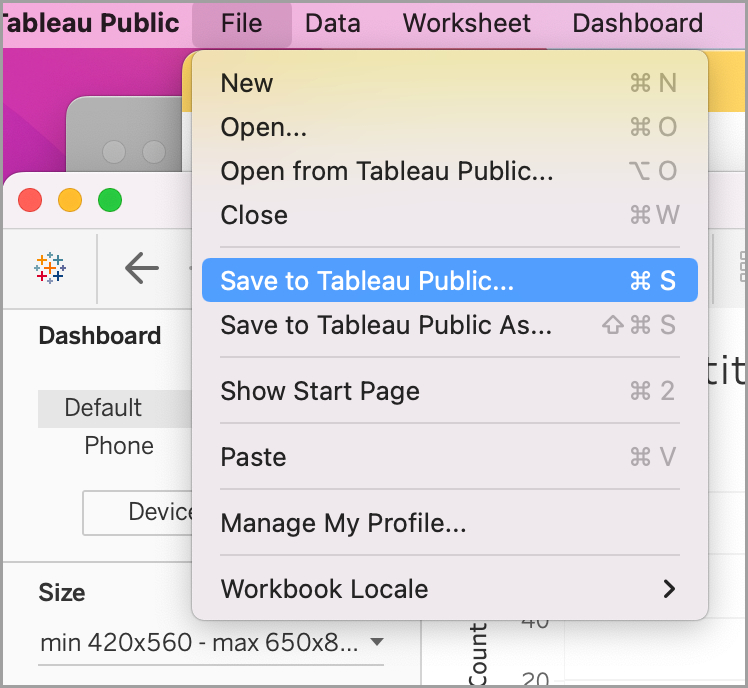
[*Watch this on video.*](https://share.descript.com/view/VxZSpfvLRUD?t=878.353)

As I've mentioned, in order to make your visualization web-accessible, you will need to create a Tableau account and publish to Tableau's site. From there, you can embed your visualizations in other web pages. 

To begin this process, select **Save to Tableau Public As...** from the **File** menu. You will be prompted to begin the process of creating an account, logging in, and publishing to the web.

## 21 You did it!

You've created your first two Tableau visualizations! Along the way, you learned:

- how to import data into Tableau
- how to navigate the Tableau workspace
- the two major categories of data in Tableau
- Tableau-generated data types
- how to create a bar chart
- how to create a stacked bar chart
- how to create a simple map
- how to resize points based on count
- how to change the color of points
- how to create a dashboard
- how to publish your Tableau project

I hope you had fun with your first Tableau project! Now you have a choice: you can learn more about Tableau, or you can learn to use another platform, called Flourish. Flourish is entirely web-based, and some students find it easier to learn. It's up to you!

